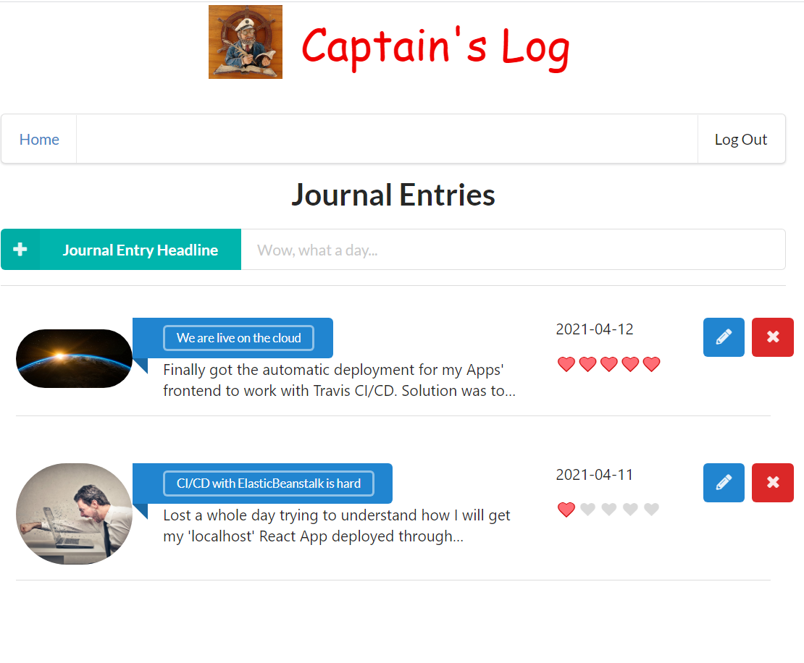
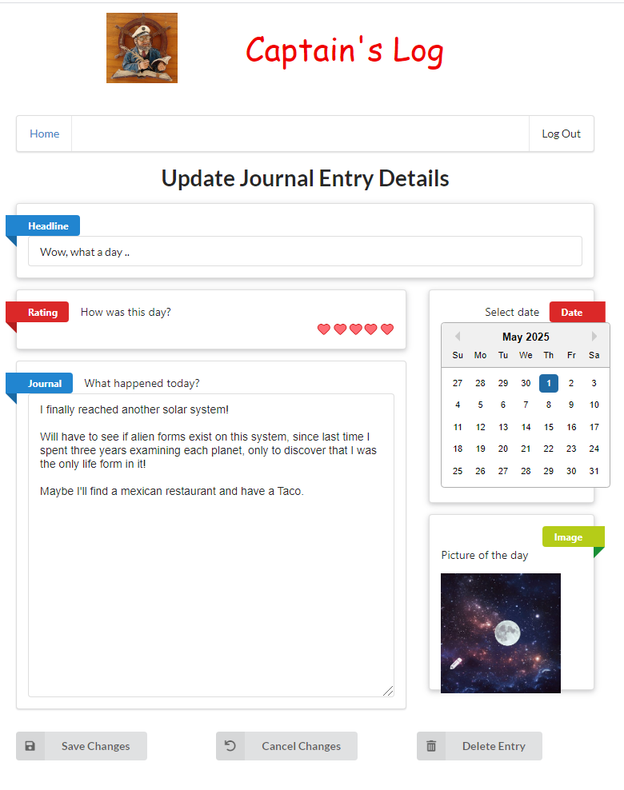
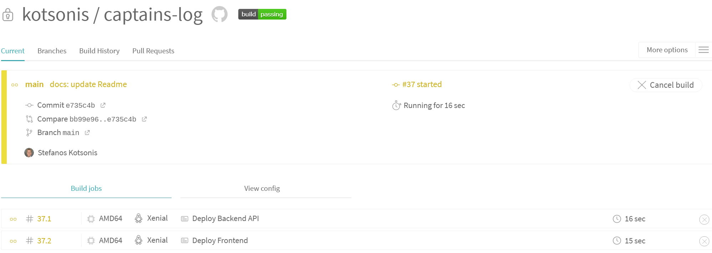

# Captains' log - daily Journal application
## Udacity Cloud Developer Nanodegree Final Project

This is a simple daily journal application using [ReactJS](https://reactjs.org/) for a single page app, [AWS Lambda](https://aws.amazon.com/lambda/) for serverless computing, and [Serverless Framework](https://www.serverless.com/) for serverless services deployment.

## Description
Captain's log is a journaling app, with which you can easily jot down the log for the day. Inspired by the daily "Captain's log" in Startrek, it's purpose is to make jotting down what was the headline and important issues to note from the day easily.

# Functionality of the application

This application allows creating/removing/updating/and fetching journal entries. Each journal entry can optionally have an attachment image. Each user only has access to the entries that he/she has created.\


# Journal entries

The application stores journal entries in an AWS DynamoDb database, and each entry contains the following fields:

* `userId` (string) - a unique id for a user
* `timestamp` (string) - unique identifier for the journal entry (the creation date/time)
* `entryId` (string) - a unique id for an item
* `entryDate` (string) - date this entry refers to
* `headline` (string) - headline of an entry
* `description` (string) - text of the journal
* `mood` (number) - mood category of the entry (0= Low Low, 1= Low, 2= lukewarm, 3 = High, 4 = High High)
* `attachmentUrl` (string) (optional) - a URL pointing to an image attached to a journal entry

The user is able to modify/update a journal entry through the following interface:



## Backend API

### Routes and Endpoints
The backend routes and endpoints are as follows:

---------------------------------------
| Route | Endpoint | Description | lambda handler | serverless definition | request schema |
|-------|----------|----|---|---|---|
| /entries | GET | Get a list of entries for the user | [getEntries](backend/src/functions/http/getEntries/handler.ts)|[getEntries/index.ts](backend/src/functions/http/getEntries/index.ts) | none
| /entries{entryId} | GET | Get the details of a specific entry | [getEntry](backend/src/functions/http/getEntry/handler.ts) | [getEntry/index.ts](backend/src/functions/http/getEntry/index.ts) | none
| /entries | POST| Add an entry to the journal | [createEntry](backend/src/functions/http/createEntry/handler.ts)|[createEntry/index.ts](backend/src/functions/http/createEntry/index.ts) | [createEntry/schema.ts](backend/src/functions/http/createEntry/schema.ts)
| /entries/{entryId} | PUT | Update an entry to the journal | [updateEntry](backend/src/functions/http/updateEntry/handler.ts)|[updateEntry/index.ts](client/src/types/UpdateEntryRequest.ts) | [updateEntry/schema.ts](backend/src/functions/http/updateEntry/schema.ts)
| /entries/{entryId} | DELETE | Delete an entry | [deleteEntry](backend/src/functions/http/deleteEntry/handler.ts) | [deleteEntry/index.ts](backend/src/functions/http/deleteEntry/index.ts) | none
| /entries/{entryId}/attachment | POST | return a signedUrl to upload an attachment | [getSignedUrl](backend/src/functions/http/getSignedUrl/handler.ts) | [getSignedUrl/index.ts](backend/src/functions/http/getSignedUrl/index.ts) | [getSignedUrl/schema.ts](backend/src/functions/http/getSignedUrl/schema.ts)

All the above routes are non accessible, unless the HTTP request contains the correct `Bearer` token.
### `Auth` Function - Authorization
[Auth0](https://auth0.com/) was used as an authentication and authorization platform. Auth0 was chosen due to it's easy (allows users to sign-in with their Google credentials), and also safety with asymmetrically encrypted JWT tokens.
On the backend side, we use [RS256 and JWKS](https://auth0.com/blog/navigating-rs256-and-jwks/) to verify the token passed by the client [auth0Authorizer](backend/src/functions/auth/auth0Authorizer/handler.ts)
### Operations with AWS services

The services used are:
- A [DynamoDB](https://aws.amazon.com/dynamodb) NoSQL database on the cloud is setup that will store our Journal items.
The spec for this database ([dynamoDb.ts](backend/src/resources/dynamoDb.ts)) partitions the entries items by `userId` and sorts by `timestamp`.
A secondary index is created which indexes by `entryId` to allow for querying by `entryId`, and a third index is created which indexes by `entryDate` to allow for displaying the journal entries in reverse chronological order.
- A [S3](https://aws.amazon.com/s3) data store on the cloud is setup that will store the todo items attachments.
The spec for this store ([s3.ts](backend/src/resources/s3.ts)) creates the store and the `BucketPolicy` to allow for interactions with this store.

In order to not be tied in to the AWS services, our business logic (the route handlers) make calls to the [database.ts](backend/src/libs/database.ts) and/or [storage.ts](backend/src/libs/storage.ts)  library functions. These libraries encapsulate the code for interacting with DynamoDb and S3. Using this scheme, porting this code to another cloud provider should be easier.
### Project backend code structure

The project code base is mainly located within the `src` folder. This folder is divided in:

- `functions` - containing code base and configuration for the lambda functions
- `libs` - containing shared code base between the lambdas
- `resources` - containing the configurations for the service resources
- `interfaces` - containing the definition of typescript interfaces for casting objects

## Frontend

The frontend app is located in `client` folder.
The frontend serves the following Routes (excerpt from [App.tsx](client/src/App.tsx))

|Route | Purpose | Class |
|---|---|---|
| `/` | Main Page - Shows Entries | [Entries](/client/src/components/JournalEntries.tsx) |
| `/entries/:entryId/edit` |Edit the Journal Attachment| [EditJournal](client/src/components/EditJournalEntry.tsx)|
|`/entries/:entryId/view` | View a Journal Entry | [ViewJournal](client/src/components/ViewEntryDetails.tsx) |
|`/entries/:entryId/create` | Create/Update Journal Entry | [CreateJournal](client/src/components/CreateJournalEntry.tsx)

The frontend connection information for the Api and Auth0 is located in [config.ts](client/src/config.ts), which stores the information in an object:

## CI/CD setup
We build out a CI/CD process using [Travis CI](https://travis-ci.org/) that automatically builds and deploys our serverless service to AWS and our fronted to AWS ElasticBeanstalk. To make development easier, our [.travis.yml](.travis.yml) script encapsulates the branch in the deployment, so that our `main` app is not affected by changes/features done in our `dev` branch.

Both `Frontend` and `Backend` are deployed through Travis CI.\


To allow for serveless to deploy on our behalf on AWS, the `AWS_SECRET_ACCESS_KEY` and `AWS_ACCESS_KEY_ID` have to be stored in the settings of our travis repository.

To allow for docker to publish on Docker Hub on our behalf, the `DOCKER_USERNAME` and `DOCKER_PASSWORD` have to be stored as well.


## Handling Secrets in serverless
In order not to expose secrets in our source code or serverless.yml file, the following strategy was used:
* Our libraries retrieve app specific endpoints/names from the `serverless.yml` environment variables. Example from [database.ts](backend/src/libs/database.ts) below:
  ```typescript
    const entriesTable = process.env.ENTRIES_TABLE
    const entryIndex = process.env.ENTRY_ID_INDEX
    const dateIndex = process.env.ENTRY_DATE_INDEX
    ```
* [serverless.yml](backend/serverless.ts) first looks up our secret using [AWS Secrets Manager](https://aws.amazon.com/secrets-manager/) and stores it under custom section.
* Then it creates these environment variables by using the AWS secret values

Excerpt from [serverless.yml](backend/serverless.ts) below:
```typescript
const serverlessConfiguration: AWS = {
    ...
    custom: {
      appSecrets: "${ssm:/aws/reference/secretsmanager/captains/app}",  
    },
    provider: {
      ...
      environment: {
        ENTRIES_TABLE: "${self:custom.appSecrets.tableName}${self:provider.stage}", 
        ENTRY_ID_INDEX: "${self:custom.appSecrets.entryIndex}${self:provider.stage}",
        ENTRY_DATE_INDEX: "${self:custom.appSecrets.tableName}bydate${self:provider.stage}",
        ENTRIES_S3_BUCKET: "${self:custom.appSecrets.s3Endpoint}${self:provider.stage}",
        JWKS: "${self:custom.appSecrets.jwksUrl}"
      },
```

## Debugging / tracing our application
We use [AWS X-Ray](https://aws.amazon.com/xray/) to trace calls to the AWS services.
Implementing this requires installation of the [aws-xray-sdk](https://www.npmjs.com/package/aws-xray-sdk) library, and then to replace our calls to AWS services as follows:
<table>
<tr>
<td> Standard </td> <td> With X-Ray tracing </td>
</tr>
<tr>
<td> 

```typescript
import * as AWS  from 'aws-sdk' 
const docClient = new AWS.DynamoDB.DocumentClient()
  ...
const s3 = new AWS.S3({
  signatureVersion: "v4",
});
```
</td>
<td>

```typescript
import * as AWS  from 'aws-sdk' 
import { captureAWS } from "aws-xray-sdk-core"; 
var XAWS = captureAWS(AWS);
const docClient = new XAWS.DynamoDB.DocumentClient()
  ...
const s3 = new XAWS.S3({
  signatureVersion: "v4",
});
```
</td>
</tr>
</table>

Once we deploy and use our service with X-Ray enabled, we can obtain a service map on the aws console as per below example:


## Running the Application

### Frontend

You can open the app at (http://captains-log-client.eba-eydjy9t2.eu-central-1.elasticbeanstalk.com/)

to deploy, you need to modify [config.ts](client/src/config.ts) and change the `callbackUrl` to localhost as follows:
```typescript
export const authConfig = {
  // TODO: Create an Auth0 application and copy values from it into this map
  domain: 'dev-34hr4k13.eu.auth0.com',            // Auth0 domain
  clientId: 'sz1ZcHoN0RtLoQJtubM3dNrRLB2uAQzR',          // Auth0 client id
  callbackUrl: 'http://localhost:80/callback' // instead of 'http://captains-log-client.eba-eydjy9t2.eu-central-1.elasticbeanstalk.com/callback'
}

```

and then run the following commands:
```bash
cd client
docker build -t client .
docker run -d -p 80:80 client
```
### Backend
To deploy the backend, you would run the following commands:
```bash
cd backend
npm i
serverless deploy -v
```