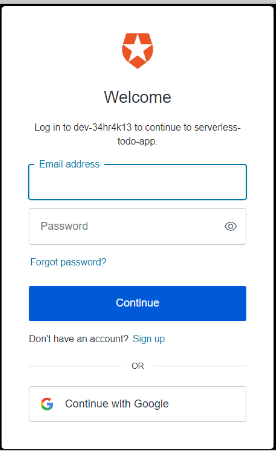
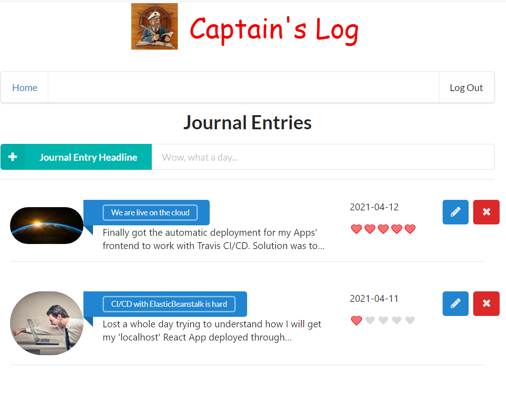

# Captains-Log Frontend

The frontend of the app has been created using [Create React App](https://github.com/facebook/create-react-app).

## Description

The frontend is a single page app that allows the user to :
* login/logout
* see his entries to date (sorted by date), with the option to:
  * add a new entry
  * modify entries
  * delete entries

### Authorization
Upon reaching the site, user is met with a simple page requesting to login:

Handling of user's login credentials is done via [Auth0](https://auth0.com/), so our user is met with Auth0's login page:

### Entries overview
The main page is as below:

## Running the app

### directly on browser
Easiest way to run the app is on the web [here](http://captains-log-client.eba-eydjy9t2.eu-central-1.elasticbeanstalk.com/). The app was deployed using [AWS EBS CLI](https://docs.aws.amazon.com/elasticbeanstalk/latest/dg/eb-cli3-install-advanced.html).

### using npm

1. `npm i` will install all required dependencies
2. `npm start` Runs the app in the development mode.

Open [http://localhost:3000](http://localhost:3000) to view it in the browser.

